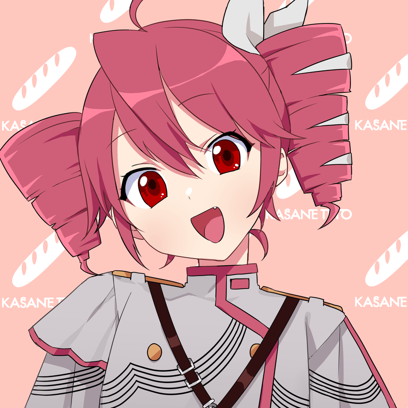

# visualize_gradient_flow_in_latent_space





this is a Python tool that lets you play around with images using gradient flow in the latent space and decoder.
It is an interesting problem to understand how a random starting point transitions to a specified target image.

## Usage

clone this repo and install the requirements:

```bash
git clone https://github.com/wowowo-wo/visualize_gradient_flow_in_latent_space
cd visualize_gradient_flow_in_latent_space
pip install -r requirements.txt
python3 cli.py --image_path PATH [--loss_type TYPE] [--steps N] [--skip_step N] [--lr LR] [--output_path PATH]
```

### Parameters

--image_path
Path to the target image. (required)

--loss_type
Which loss function to use for optimization. Default is mse. Options include mse, l1, ssim, vgg, lpips, psnr, tv, and sinkhorn.

--steps
Number of optimization steps to run. More steps usually mean better results. Default is 100.

--skip_step
How often (in steps) to save intermediate results. Default is 1 (every step).

--lr
Learning rate for the optimizer. Controls the size of each update step. Default is 0.1.

--output_path
File path where the final output gif will be saved. Default is grad_result.gif.

## requirements

```bash
pip install requirements.txt
```

requirements.txt contains both the essential dependencies for the main program and optional ones used for certain loss functions.

## background

Recently, deep generative models like VAEs and diffusion models have gained a lot of attention for their ability to generate and represent images. Rather than training a new model from scratch, this project explores the latent space of a pretrained VAE, gradually optimizing a latent vector through gradient-based methods to reconstruct a specific target image.

This project uses the stabilityai/sd-vae-ft-mse model — a pretrained Variational Autoencoder fine-tuned with mean squared error loss specifically for Stable Diffusion. By leveraging this well-optimized VAE, we can efficiently encode and decode images into a meaningful latent space, which helps make the latent optimization process smoother and the reconstructed images more accurate.

Interestingly, this process can be seen as the reverse of something I explored before: deform_image_pde, where an image is gradually deformed into noise by adding perturbations.  Of course, such transformations aren’t mathematically reversible, but we can still compare the two directions as input/output mappings: 'image → noise' vs 'noise → image'.

From a media art perspective, this also touches on deeper questions like: When does a generated structure start to feel like an object? At what point do humans begin to recognize something as a meaningful form? This project can be seen as an exploration of those questions, too.


